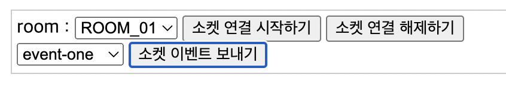

# 이 레포지토리에 대하여
node.js 의 socket.io 를 typescript 로 구현한 샘플 프로젝트 입니다. socket.io 에서 지원하는 클러스터링 모드를 pm2 를 이용하여 적용한 상태입니다. 그렇기 때문에 이 레포지토리에서 설정된 클러스터링 모드를 그대로 사용하기 위해서는 전역으로 설치된 일반 pm2 패키지는 삭제하고 @socket.io/pm2 패키지를 전역으로 설치해야 합니다. 이 레포지토리는 지속적으로 수정 될 수 있습니다. (기능 추가 등)

<br /><br />

# 이 레포지토리를 테스트 해보는 방법
1) git clone 받습니다.
```
git clone https://github.com/wisdomstar94/socket-io-sample.git
```
2) clone 받은 폴더로 이동합니다.
```
cd socket-io-sample
```
3) npm install 을 진행합니다.
```
npm i
```
4) 기존에 pm2 가 전역으로 설치되어 있다면 삭제를 진행합니다.
```
npm uninstall -g pm2
```
5) socket.io 용 pm2 를 설치합니다.
```
npm i -g @socket.io/pm2
```
6) pm2 로 프로젝트를 구동합니다. (이 때 8080포트는 사용중이면 안됩니다.)
```
npm run serve:pm2
```
7) http://localhost:3000/api/test 에 접속합니다.

8) 소켓 연결 시작하기, 해제하기, 이벤트 보내기 버튼을 클릭하여 프로젝트를 구동한 터미널에 콘솔 로그가 찍히는 것을 확인해봅니다.
